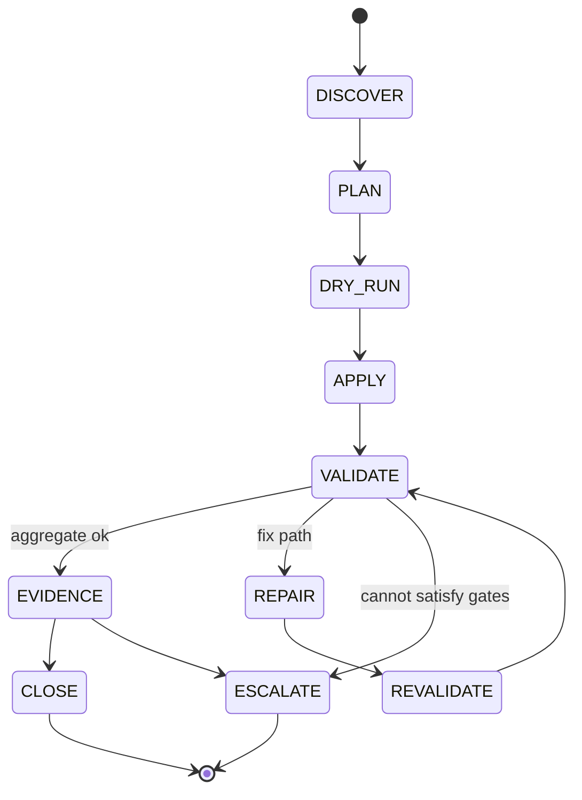

# Workflow states and transitions

## Goal

**Controlled state transitions:** phases are observable; **forbidden jumps** prevent leapfrogging to release. Aligns with **I-001** — never treat `warn` / `skip` or **`skipped`** / `unknown` / `degraded` / `blocked` / `not_run` as success for an honest **CLOSE**.

**Related:** `docs/REPO-BOUNDARIES.md`, `docs/DEGRADED-MODES.md`, `policies/auto-approve-matrix.md`, `policies/invariants.md`, `.agent/operating-contract.md`, `docs/VALIDATION.md`, `docs/AUTONOMY.md`.

## States (canonical)

| State | Role |
|-------|------|
| **DISCOVER** | Read-only inventory; no writes. |
| **PLAN** | Intent, scope, risk class, rollback sketch. |
| **DRY_RUN** | Preview / `WhatIf` / simulate apply. |
| **APPLY** | Mutating repo or environment (bounded where autonomous). |
| **VALIDATE** | Run validators / gates; consume structured envelopes. |
| **REPAIR** | Fix within approved risk (reversible or explicitly approved destructive). |
| **REVALIDATE** | Mandatory re-check after REPAIR on governed paths. |
| **EVIDENCE** | Attach envelopes, diffs, notes for audit. |
| **CLOSE** | Honest task end: summary matches aggregate status; no cosmetic upgrade of non-`ok`. |
| **ESCALATE** | Hand off to human/steward: cannot satisfy gates, scope unclear, or steward approval required — **not** a success close. |

## Allowed backbone

```text
DISCOVER → PLAN → DRY_RUN → APPLY → VALIDATE → REPAIR → REVALIDATE → EVIDENCE → CLOSE
                                                              ↘ EVIDENCE → ESCALATE
```

- **`REPAIR → REVALIDATE`** may loop zero or more times.  
- **`EVIDENCE → ESCALATE`**: when validators stay non-`ok`, scope is steward-class without approval, or policy forbids autonomous continuation — document reason in evidence bundle.  
- **`EVIDENCE → CLOSE`**: only when aggregate is **`ok`** per governed semantics and evidence is complete.



## Forbidden transitions (explicit)

| Forbidden | Rule |
|-----------|------|
| **APPLY → CLOSE** without **VALIDATE** | No success close after write without agreed validators. |
| **VALIDATE → CLOSE** as **success** when aggregate is **`warn`**, **`skip`**, **`skipped`**, **`unknown`**, **`degraded`**, **`blocked`**, or **`not_run`** | **I-001** / `neverTreatAsPassed`; success **CLOSE** only on governed **`ok`**. |
| **PLAN → RELEASE** without **APPROVAL** (and strict path + evidence) | Release is steward; not a direct arc from intent. |
| **REPAIR → CLOSE** without **REVALIDATE** | Post-repair state unknown until validators re-run. |

Additional: **DISCOVER → APPLY** on **critical surfaces** without plan/dry-run/approval as required; **DRY_RUN → DEPLOY** without approval — see `policies/autonomy-policy.json`.

## Transition table (selected)

| From | To | Allowed? | Condition |
|------|-----|----------:|-------------|
| APPLY | VALIDATE | **required** | After material writes. |
| VALIDATE | CLOSE | only if **ok** | Aggregate **`ok`**; steward/high-risk should route through **EVIDENCE** first. |
| VALIDATE | EVIDENCE | yes | When bundling proof before **CLOSE** or **ESCALATE**. |
| VALIDATE | ESCALATE | yes | Gates cannot pass; approval missing; out-of-scope. |
| EVIDENCE | CLOSE | only if **ok** | Evidence matches honest aggregate status. |
| EVIDENCE | ESCALATE | yes | Non-`ok`, missing approval, or policy forbids autonomous continuation. |
| REPAIR | REVALIDATE | **required** | After governed repair. |
| PLAN | RELEASE | **no** | Approval + strict validation + evidence. |

## Operator / agent behaviour

If automation cannot enforce phases yet, **naming phases in PR/session notes** is the control; forbidden rows still bind. **ESCALATE** is a valid terminal outcome — prefer it over a dishonest **CLOSE**.
